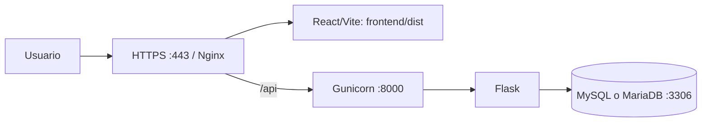

# Despliegue en VPS Linux — Misión Matemática

> El despliegue soportado actualmente usa Docker, Certbot y el dominio `misionmatematica.com`. Seguir [DOCKER_DEPLOY.md](DOCKER_DEPLOY.md) como guía operativa principal. Este documento conserva referencias de arquitectura para una instalación manual, que no es el flujo recomendado.

## Topología objetivo



La aplicación es dinámica: el frontend se sirve como archivos estáticos y la API Flask debe permanecer activa. MySQL/MariaDB almacena usuarios, partidas, progreso, auditoría, catálogo y recompensas.

## Perfil inicial del VPS

El objetivo solicitado es un VPS Linux de **4 vCPU, 8 GB de RAM y 75 GB NVMe**. Es un punto de partida operativo, no una medición de carga. La evaluación actual en [EVALUACION_HOSTING.md](EVALUACION_HOSTING.md) estima que el software puede iniciar con menos recursos; se recomienda este margen por los assets del juego, la base de datos, sistema operativo, registros y crecimiento.

Instalar una distribución Linux con soporte vigente, Nginx, Python 3.12, Node.js compatible con Vite 8 (Node 20.19+ o 22.12+), MySQL 8 o MariaDB compatible, y Git. Gunicorn `26.2.0` requiere Python 3.10 o posterior.

## Instalación resumida

```bash
sudo mkdir -p /opt/mision-matematica /etc/mision-matematica
sudo chown -R "$USER":"$USER" /opt/mision-matematica
git clone https://github.com/willder2305/MisionMatematica.git /opt/mision-matematica
cd /opt/mision-matematica/backend
python3.12 -m venv .venv
.venv/bin/pip install -r requirements.txt
cd ../frontend
npm ci
npm run build
```

Crear la base de datos y ejecutar los scripts SQL en el orden documentado en [README.md](README.md). El proceso no incluye un ejecutor automático de migraciones: antes de cada actualización se debe respaldar la base y aplicar únicamente los scripts que correspondan a la versión a desplegar.

## Variables de entorno de producción

Crear `/etc/mision-matematica/mision-matematica.env` con permisos `640`; no guardar este archivo en el repositorio. Como mínimo:

```text
APP_ENV=production
FLASK_DEBUG=false
JWT_SECRET_KEY=<secreto-aleatorio-largo>
DB_HOST=127.0.0.1
DB_PORT=3306
DB_USER=<usuario-restringido-de-aplicacion>
DB_PASSWORD=<contrasena-segura>
DB_NAME=tesis_matematica_app
FRONTEND_URLS=https://misionmatematica.com,https://www.misionmatematica.com
TRUST_PROXY_HEADERS=true
RATE_LIMIT_ENABLED=true
RATE_LIMIT_AUTH_PER_MINUTE=10
RATE_LIMIT_API_PER_MINUTE=240
GUNICORN_BIND=127.0.0.1:8000
GUNICORN_WORKERS=2
GUNICORN_THREADS=2
GUNICORN_TIMEOUT=60
```

El backend rechaza el secreto JWT de desarrollo cuando `APP_ENV=production`. Con Nginx como proxy inverso local, `TRUST_PROXY_HEADERS=true` permite conservar la IP de cliente para el límite de solicitudes. No habilitarlo si Flask queda expuesto directamente.

`GUNICORN_WORKERS` y `GUNICORN_THREADS` son configurables. Los valores iniciales de dos workers y dos threads deben revisarse con CPU, RAM, latencia y conexiones de base de datos; no fijar una fórmula sin datos de producción.

## Servicios y red

1. Construir el frontend (`npm run build`) y servir `frontend/dist` con Nginx.
2. Copiar [deploy/mision-matematica.service](deploy/mision-matematica.service) a systemd, revisar sus rutas y ejecutar `sudo systemctl enable --now mision-matematica`.
3. Instalar [deploy/nginx-mision-matematica.conf](deploy/nginx-mision-matematica.conf), configurar dominio/certificado TLS, validar `sudo nginx -t` y recargar Nginx.
4. Exponer solo 80/443 al público. Gunicorn queda en `127.0.0.1:8000` y MySQL/MariaDB no requiere acceso público.
5. Comprobar localmente `curl http://127.0.0.1:8000/api/health` y externamente `https://misionmatematica.com/api/health`.

El healthcheck confirma que Flask responde; no consulta MySQL y no expone estado interno. La supervisión de base de datos debe hacerse con una verificación autenticada desde el entorno de operaciones.

## Nginx, HTTPS y SPA

Nginx atiende los archivos con hash del build y redirige rutas desconocidas a `index.html`, requerido para que las rutas de la SPA funcionen al recargar. Solo `/api/` se reenvía a Gunicorn. La plantilla manual usa `misionmatematica.com`, redirige `www` al dominio canónico y requiere el certificado de Let's Encrypt indicado en ella.

## Operación, backups y reversión

- Respaldar MySQL/MariaDB a diario con retención y copia fuera del VPS. Probar restauraciones periódicamente.
- Conservar el `.env`/EnvironmentFile en respaldo cifrado, separado del código.
- No hay carga de archivos de usuarios ni generación de PDF detectada actualmente; los assets del juego están versionados con el frontend.
- Antes de desplegar, ejecutar pruebas backend, pruebas Node y build; después verificar `/api/health`, login y una partida de prueba.
- Para revertir, conservar el commit anterior, reconstruir `frontend/dist`, reinstalar dependencias si cambian y reiniciar el servicio. Si hay cambios SQL, restaurar el backup o aplicar la estrategia de reversión específica del script.

## Pendientes externos antes de publicar

Dominio, DNS, certificado TLS, proveedor VPS, usuario y contraseña restringidos de MySQL, secreto JWT de producción, política de backups, monitoreo, correo SMTP real y reglas de firewall no están definidos en el repositorio.
