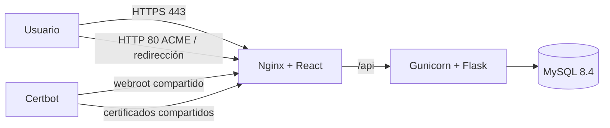

# Despliegue Docker de producción — Misión Matemática

## Alcance y arquitectura

Esta es la vía oficial de producción para `misionmatematica.com`. React se compila durante la construcción de la imagen, Nginx sirve la SPA y reenvía `/api/` a Gunicorn/Flask; Flask se comunica con MySQL 8.4 mediante la red interna de Docker.



Solo `frontend` publica `80` y `443`. `backend:8000` y `db:3306` son internos. `mysql_data` conserva datos; `certbot_www` sirve retos ACME y `letsencrypt_data` conserva certificados.

## DNS antes de certificar

El dominio canónico es `https://misionmatematica.com`; `https://www.misionmatematica.com` redirige al canónico. Configurar en el proveedor DNS:

| Tipo | Nombre | Destino |
| --- | --- | --- |
| A | `@` | `148.113.250.253` |
| CNAME | `www` | `misionmatematica.com` |

Si no se admite CNAME para `www`, usar un A de `www` a `148.113.250.253`. No crear AAAA salvo que el VPS tenga IPv6 público y los puertos 80/443 estén abiertos. No modificar registros MX, TXT, DKIM o SPF existentes.

Tras la propagación, comprobar desde una red externa:

```bash
dig +short A misionmatematica.com
dig +short CNAME www.misionmatematica.com
dig +short A www.misionmatematica.com
```

Los dos nombres deben resolver a `148.113.250.253`. DNS, propagación y certificados públicos no se solicitan desde este repositorio ni desde una máquina local.

## Preparación del VPS

Instalar Docker Engine, el plugin Docker Compose y Git según la distribución Linux:

```bash
docker --version
docker compose version
git --version
```

Permitir SSH antes de activar UFW. Ajustar el puerto si SSH no usa `22`:

```bash
sudo ufw allow OpenSSH
sudo ufw allow 80/tcp
sudo ufw allow 443/tcp
sudo ufw enable
sudo ufw status verbose
```

Preparar la rama de producción:

```bash
sudo mkdir -p /opt/mision-matematica
sudo chown -R "$USER":"$USER" /opt/mision-matematica
git clone https://github.com/willder2305/MisionMatematica.git /opt/mision-matematica
cd /opt/mision-matematica
git checkout main
git pull --ff-only origin main
```

Para este flujo no instalar XAMPP, Node, Python, Nginx ni MySQL en el host. Confirmar que ningún Apache/Nginx host usa 80/443.

## Variables de producción

```bash
cd /opt/mision-matematica
cp .env.docker.example .env
chmod 600 .env
```

Reemplazar todos los marcadores `CAMBIAR_`. Los valores relevantes son:

```text
MYSQL_DATABASE=tesis_matematica_app
MYSQL_USER=mision_user
MYSQL_PASSWORD=<contraseña-DB-segura>
MYSQL_ROOT_PASSWORD=<contraseña-root-DB-distinta-y-segura>
JWT_SECRET_KEY=<secreto-aleatorio-largo>
FRONTEND_URLS=https://misionmatematica.com,https://www.misionmatematica.com
TRUST_PROXY_HEADERS=true
PRIMARY_DOMAIN=misionmatematica.com
WWW_DOMAIN=www.misionmatematica.com
LETSENCRYPT_EMAIL=<correo-administrativo-real>
VITE_API_URL=/api
```

Generar JWT:

```bash
python3 -c 'import secrets; print(secrets.token_urlsafe(64))'
```

`VITE_API_URL=/api` mantiene frontend y API bajo el mismo origen HTTPS; no colocar secretos en variables `VITE_*`. `.env`, certificados y claves privadas están ignorados por Git.

## Primer arranque y TLS

Validar, construir y arrancar el modo bootstrap HTTP:

```bash
docker compose --env-file .env -f docker-compose.prod.yml config -q
docker compose --env-file .env -f docker-compose.prod.yml build
docker compose --env-file .env -f docker-compose.prod.yml up -d
docker compose --env-file .env -f docker-compose.prod.yml ps
curl -fsS http://127.0.0.1/api/health
```

Sin certificado Nginx sirve HTTP temporal y `/.well-known/acme-challenge/`; no usa certificados ficticios ni entra en bucles. Cuando DNS y firewall ya funcionen desde Internet, emitir el certificado:

```bash
cd /opt/mision-matematica
chmod +x scripts/init-letsencrypt.sh scripts/renew-letsencrypt.sh
./scripts/init-letsencrypt.sh
```

El script levanta/verifica HTTP, ejecuta Certbot con `webroot` para ambos nombres y recrea Nginx al terminar. Con certificado, HTTP y `www` redirigen a `https://misionmatematica.com`.

Validación final:

```bash
curl -I http://misionmatematica.com
curl -I https://www.misionmatematica.com
curl -fsS https://misionmatematica.com/api/health
docker compose --env-file .env -f docker-compose.prod.yml exec -T frontend nginx -t
```

Se espera `301` hacia `https://misionmatematica.com/...` en las dos primeras comprobaciones. Probar además login, una partida y una solicitud de API desde el navegador.

## Renovación de Let's Encrypt

La renovación es una ejecución única, no un contenedor en bucle. Probar primero:

```bash
docker compose --env-file .env -f docker-compose.prod.yml run --rm --no-deps certbot renew --dry-run
```

Programar cron con un log fuera del repositorio:

```bash
sudo install -d -m 750 /var/log/mision-matematica
crontab -e
```

```cron
17 3 * * * cd /opt/mision-matematica && ./scripts/renew-letsencrypt.sh >> /var/log/mision-matematica/certbot-renew.log 2>&1
```

Certbot renueva únicamente cuando corresponde; el script valida y recarga Nginx.

## Operación y actualizaciones

```bash
docker compose --env-file .env -f docker-compose.prod.yml ps
docker compose --env-file .env -f docker-compose.prod.yml logs -f frontend
docker compose --env-file .env -f docker-compose.prod.yml logs -f backend
docker compose --env-file .env -f docker-compose.prod.yml logs -f db

git pull --ff-only origin main
docker compose --env-file .env -f docker-compose.prod.yml build
docker compose --env-file .env -f docker-compose.prod.yml up -d
```

Para volver a un commit conocido, respaldar la base, cambiar a ese commit y repetir `build` y `up -d`. Nunca usar `docker compose down -v` en producción: elimina la base y los volúmenes de Certbot.

## Base de datos y backups

MySQL se inicializa solo si `mysql_data` está vacío. Migraciones históricas no se ejecutan solas. Antes de cualquier SQL incremental:

```bash
mkdir -p /opt/mision-matematica-backups
docker compose --env-file .env -f docker-compose.prod.yml exec -T db sh -c 'exec mysqldump --default-character-set=utf8mb4 --no-tablespaces -u"$MYSQL_USER" -p"$MYSQL_PASSWORD" "$MYSQL_DATABASE"' > /opt/mision-matematica-backups/mision-matematica-$(date +%F).sql
```

Restaurar solamente dumps validados y con la aplicación sin escrituras:

```bash
docker compose --env-file .env -f docker-compose.prod.yml exec -T db sh -c 'exec mysql --default-character-set=utf8mb4 -u"$MYSQL_USER" -p"$MYSQL_PASSWORD" "$MYSQL_DATABASE"' < /opt/mision-matematica-backups/archivo.sql
```

Guardar copia cifrada fuera del VPS y probar restauraciones. Los mapas, sprites y demás assets están versionados; no se detectó almacenamiento persistente de uploads/PDF de usuarios.

## Diagnóstico

- Certbot falla: confirmar DNS público, UFW, firewall del proveedor y puerto 80 libre.
- CORS: revisar que `.env` tenga exactamente ambos orígenes HTTPS separados por coma y recrear `backend`.
- Sin API: confirmar `VITE_API_URL=/api`, Nginx `/api/` y backend healthy.
- IP de cliente incorrecta: `TRUST_PROXY_HEADERS=true` es seguro aquí porque Flask no se publica y Nginx reemplaza `X-Forwarded-For` con la IP remota.
- Puerto ocupado: detener el proceso host antes de iniciar; no abrir puertos del backend o MySQL como alternativa.
