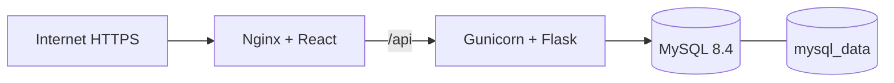

# Despliegue Docker — Misión Matemática

## Arquitectura



El contenedor `frontend` usa Node solo durante el build multi-stage y ejecuta Nginx en tiempo de ejecución. `backend` usa Python 3.12 y Gunicorn; `db` usa MySQL 8.4 con un volumen nombrado. No se ejecutan Vite ni el servidor de desarrollo de Flask.

## Requisitos del VPS

- VPS Linux con Docker Engine y Docker Compose plugin actuales.
- Referencia inicial: 4 vCPU, 8 GB RAM y 75 GB NVMe. No hay benchmark de carga; revisar CPU, memoria y conexiones antes de imponer límites de contenedor.
- Puertos públicos 80 y 443. MySQL no se publica hacia Internet.
- Dominio, DNS y certificado TLS son pendientes externos.

Instalar Docker siguiendo la documentación oficial de la distribución y comprobarlo con:

```bash
docker --version
docker compose version
```

## Primera publicación

```bash
git clone https://github.com/willder2305/MisionMatematica.git
cd MisionMatematica
cp .env.docker.example .env
```

Editar `.env` antes de continuar. Reemplazar las cuatro credenciales marcadas `CAMBIAR_`, definir el dominio real en `FRONTEND_URLS` y generar el secreto JWT:

```bash
python3 -c "import secrets; print(secrets.token_urlsafe(64))"
```

No use credenciales reales en `VITE_API_URL`: todo `VITE_*` queda visible en el JavaScript compilado. Para este stack, mantener `VITE_API_URL=/api` permite que navegador, Nginx y API trabajen con el mismo origen.

```bash
docker compose -f docker-compose.prod.yml config
docker compose -f docker-compose.prod.yml build
docker compose -f docker-compose.prod.yml up -d
docker compose -f docker-compose.prod.yml ps
curl -fsS http://127.0.0.1/api/health
```

El primer arranque crea `mysql_data` e inicializa la base desde `database/init_database.sql`. El script ocurre **solo si el volumen está vacío**. No se ejecutan `DROP DATABASE`, `DROP TABLE` ni migraciones incrementales automáticamente en despliegues posteriores.

## Acceso, Nginx y HTTPS

Nginx publica React, aplica fallback SPA para recargas en rutas como `/juego` o `/tienda`, comprime HTML/CSS/JS/JSON/SVG, mantiene los assets de Vite en caché largo y pasa `/api/` sin eliminar ese prefijo hacia `backend:8000`.

La imagen funciona inicialmente por HTTP en el puerto 80. Para HTTPS, montar certificados en el contenedor Nginx y añadir un bloque TLS, o colocar un reverse proxy/terminador TLS administrado delante del puerto 80. No se incluye un dominio ni certificado ficticio. Después de configurar TLS, actualizar `FRONTEND_URLS=https://dominio-real` y reiniciar el stack.

## Operación diaria

```bash
docker compose -f docker-compose.prod.yml ps
docker compose -f docker-compose.prod.yml logs -f frontend
docker compose -f docker-compose.prod.yml logs -f backend
docker compose -f docker-compose.prod.yml logs -f db
docker compose -f docker-compose.prod.yml restart backend frontend
docker compose -f docker-compose.prod.yml down
```

`down` normal conserva `mysql_data`. **No ejecutar `docker compose down -v` en producción**: elimina los volúmenes y borra la base de datos persistente.

Los healthchecks son: `mysqladmin ping` para `db`, `GET /api/health` local para `backend`, y una solicitud HTTP a Nginx para `frontend`. El endpoint de API no incluye credenciales, SQL ni versión de componentes.

## Migraciones controladas

Antes de cualquier SQL incremental, crear un backup, revisar el script y aplicarlo manualmente:

```bash
./scripts/docker-run-sql.sh database/actualizar_catalogo_personal_temas.sql
```

El script acepta únicamente archivos dentro de `database/` y usa las variables ya presentes dentro del contenedor `db`; la contraseña no se escribe en el comando del host. No hay un ejecutor automático porque los scripts existentes corresponden a etapas históricas y deben seleccionarse según la versión instalada.

## Backup y restauración

Crear un directorio de backups fuera del repositorio o que permanezca ignorado por Git. Con el stack activo:

```bash
mkdir -p backups
docker compose -f docker-compose.prod.yml exec -T db sh -c 'exec mysqldump -u"$MYSQL_USER" -p"$MYSQL_PASSWORD" "$MYSQL_DATABASE"' > backups/mision-matematica-$(date +%F).sql
```

Restaurar solo después de validar el dump y de detener escrituras de la aplicación:

```bash
docker compose -f docker-compose.prod.yml exec -T db sh -c 'exec mysql -u"$MYSQL_USER" -p"$MYSQL_PASSWORD" "$MYSQL_DATABASE"' < backups/archivo.sql
```

Actualmente no se detectó almacenamiento persistente de uploads, PDF ni exports: los mapas, sprites y UI se compilan como assets versionados del frontend. Si se agregan archivos de usuario en el futuro, deben ir a un volumen o almacenamiento externo y entrar en el plan de backup.

## Actualización y reversión

```bash
git pull origin main
docker compose -f docker-compose.prod.yml build
docker compose -f docker-compose.prod.yml up -d
docker compose -f docker-compose.prod.yml ps
```

Aplicar primero las migraciones manuales requeridas por la versión, respaldando la base previamente. Para revertir código, volver al commit anterior, reconstruir frontend/backend y ejecutar `up -d`; una reversión de esquema requiere una estrategia específica y el backup correspondiente.

## Prueba local con Docker

```bash
cp .env.docker.example .env
docker compose -f docker-compose.local.yml up --build -d
docker compose -f docker-compose.local.yml ps
```

Local publica frontend en `http://localhost:8080`, backend en `http://localhost:8000` y MySQL en `localhost:3307`, evitando conflicto con XAMPP/MySQL en 3306. Verificar login, juego, tienda, panel de estudiante, institución, secciones, asignaciones, reportes y administración antes de publicar. Para detenerlo: `docker compose -f docker-compose.local.yml down`.

## Errores frecuentes

- `DB_HOST=localhost`: es incorrecto dentro de Docker; debe ser `db`.
- Frontend sin API: confirmar que el build usó `VITE_API_URL=/api`, que backend está healthy y que Nginx conserva `location /api/`.
- Base sin datos: confirmar que se inició con volumen nuevo y revisar `docker compose ... logs db`. Los scripts de init no se repiten con un volumen existente.
- Puerto 80 ocupado: liberar el servicio host o ajustar temporalmente el mapeo de `frontend` en el compose de producción.
- Error de JWT en producción: definir un secreto aleatorio real; el backend bloquea valores de desarrollo cuando `APP_ENV=production`.
