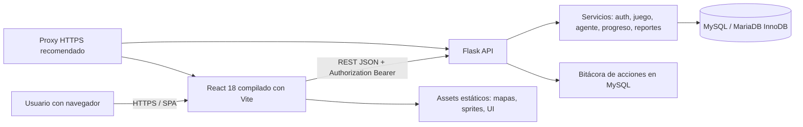

# Evaluación técnica de hosting — Misión Matemática

**Fecha de inventario:** 26 de septiembre de 2026  
**Alcance:** inspección local del repositorio, archivos de configuración, build existente, entorno Python/Node y metadatos de la base de datos local. Este documento no modifica la aplicación ni configura un proveedor.

## Resumen ejecutivo

Misión Matemática es una aplicación web educativa dinámica. El cliente es una SPA de React compilada con Vite; el servidor es una API REST en Flask que aplica autenticación JWT, lógica académica, juego, personalización, auditoría y reportes. Los datos persistentes se almacenan en MySQL-compatible mediante `mysql-connector-python`.

No es una aplicación estática completa: el build de React puede servirse como archivos estáticos, pero la API Flask y la base de datos son indispensables para registro, inicio de sesión, partidas, progreso, monedas, grupos, asignaciones, auditoría y reportes. Por ello necesita un proceso backend permanentemente disponible y una base MySQL/MariaDB persistente.

El repositorio no contiene Docker, `docker-compose`, `Procfile`, configuración de Nginx/Apache, archivo WSGI dedicado ni dependencia de un servidor WSGI de producción. El único arranque implementado es `app.run(host="127.0.0.1", port=5000, debug=Config.DEBUG)`, apropiado para desarrollo local. Para producción debe añadirse fuera del alcance de este inventario una capa WSGI y un proxy/servidor web compatible.

**Conclusión de hosting basada en el código actual:** un hosting compartido tradicional orientado solo a PHP/archivos estáticos no es adecuado. Podría funcionar únicamente si el proveedor permite una aplicación Python WSGI persistente, variables de entorno, un build estático de React y una base MySQL/MariaDB accesible. Un VPS administrado o un PaaS que soporte Python + MySQL es la alternativa más compatible con lo encontrado.

## Arquitectura del sistema



### Flujo real de una solicitud

1. El navegador descarga `frontend/dist`, que contiene HTML, CSS, JavaScript y assets pixel-art.
2. React usa Axios y toma `VITE_API_URL` en tiempo de compilación. Si no existe, el código usa `http://127.0.0.1:5000/api`.
3. El token JWT se envía por la cabecera `Authorization: Bearer ...`; los tokens de acceso y refresh se guardan actualmente en `localStorage`.
4. Flask registra los blueprints bajo `/api/*`, aplica CORS, rate limit en memoria, cabeceras de seguridad y bitácora de mutaciones.
5. Cada servicio abre conexiones MySQL de corta duración mediante `mysql.connector.connect`; no se encontró un pool de conexiones configurado.
6. MySQL/MariaDB conserva usuarios, sesiones revocables, auditoría, perfiles, grupos, juego, ejercicios, progreso, inventario, monedas y asignaciones.

## Inventario de componentes

| Componente | Ubicación | Tecnología/función | Estado para producción |
| --- | --- | --- | --- |
| Frontend | `frontend/` | React `18.3.1`, React DOM, Axios y Vite `8.3.1`. | Debe compilarse y servirse como estático. |
| API | `backend/` | Flask `3.0.3`, Flask-CORS, JWT HMAC propio, lógica de negocio en servicios. | Debe ejecutarse permanentemente detrás de WSGI. |
| Base de datos | `database/`, MySQL local | `mysql-connector-python 9.0.0`; esquema SQL y migraciones manuales. | Requiere servicio persistente y backups. |
| Agente adaptativo | `backend/agent/` | Motor de reglas y generador procedimental local. | No requiere GPU, modelo externo ni proceso separado. |
| Assets | `frontend/src/assets/`, `frontend/public/` | Mapas, sprites, vidas, moneda e iconos. | Se emiten en el build estático. |
| Pruebas | `backend/tests/`, `frontend/tests/` | `unittest` y `node:test`. | Solo durante CI/QA; no como servicio permanente. |
| Scripts | `backend/scripts/` | Seed local de un estudiante QA. | No debe ejecutarse automáticamente en producción. |

No se encontraron directorios o rutas activas de `uploads`, almacenamiento de archivos por usuario, importación/exportación de PDF, cola de trabajos, Redis, WebSocket, Celery, cron interno, Docker, CI/CD o almacenamiento de objetos.

## Frontend y entrega estática

### Herramientas y versión

| Dato | Valor comprobado |
| --- | --- |
| Framework | React `18.3.1` |
| Build | Vite `8.3.1` con `@vitejs/plugin-react 6.1.1` |
| HTTP | Axios `1.7.4` |
| Lockfile | `package-lock.json`, lockfile v3 |
| Node usado en el entorno auditado | `v24.14.1` |
| Requisito de Node encontrado en el lockfile de Vite/plugin | `^20.19.0 || >=22.12.0` |
| Versión mínima de npm | No determinada actualmente. |

Para un build reproducible se debe usar una versión de Node permitida por Vite. La versión comprobada localmente es Node `24.14.1`; el requisito declarado por los paquetes permite Node `20.19+` o `22.12+`. El build usa `npm.cmd run build` y genera `frontend/dist`.

### Resultado y tamaño actual

| Elemento medido | Tamaño |
| --- | ---: |
| `frontend/dist` actual | 155,697,436 bytes / 148.48 MiB |
| Assets fuente en `frontend/src/assets` | 174,371,337 bytes / 166.29 MiB |
| Archivos emitidos en `dist` | 171 |
| `frontend/public` | Un `favicon.png` de 5,332 bytes |
| `frontend/node_modules` local de build | 57,896,222 bytes / 55.21 MiB |

El tamaño del build está dominado por mapas y sprites PNG. Node y `node_modules` son necesarios para construir en CI o en el servidor de build, pero no para servir el directorio `dist` una vez publicado.

### Configuración de API y dominio

- `VITE_API_URL` es la URL base de API y se inserta al compilar. Para producción debe apuntar a la URL HTTPS pública de la API, por ejemplo `https://api.ejemplo.com/api` o el prefijo equivalente del mismo dominio.
- Si `VITE_API_URL` cambia, es necesario ejecutar un nuevo build del frontend; no se resuelve dinámicamente en tiempo de ejecución.
- El frontend no requiere un servidor Node persistente en producción. Vite solo es el servidor de desarrollo/previsualización local.
- No se encontró `vite.config.*`; se usan los valores estándar de Vite y los scripts definidos en `package.json`.

## Backend Flask

### Dependencias declaradas

`backend/requirements.txt` contiene exclusivamente:

| Paquete | Versión fijada | Uso observado |
| --- | ---: | --- |
| Flask | `3.0.3` | API y blueprints. |
| flask-cors | `4.0.1` | CORS restringido a `FRONTEND_URLS`. |
| mysql-connector-python | `9.0.0` | Conexión directa a MySQL/MariaDB. |
| python-dotenv | `1.0.1` | Carga local de `.env`. |

La versión de Python usada por el entorno virtual auditado es **Python `3.12.14`**. El repositorio no declara un rango `Requires-Python`, por lo que la única versión verificada por el proyecto actual es Python 3.12. Para hosting, Python 3.12 es el requisito recomendado basado en evidencia; compatibilidad con versiones anteriores no está determinada actualmente.

### WSGI y procesos

- **Servidor WSGI configurado actualmente:** No determinado actualmente; no existe dependencia ni archivo de configuración para Gunicorn, Waitress, uWSGI o mod_wsgi.
- **Punto de entrada disponible:** `backend/app.py` expone `app` y `crear_app()`. Un integrador WSGI puede importar `app`, pero esta integración no está documentada como configuración de despliegue en el proyecto.
- **Arranque actual:** servidor de desarrollo Flask en `127.0.0.1:5000`.
- **Proceso permanente requerido:** sí, una o más instancias WSGI de Flask deben permanecer activas mientras la aplicación esté disponible.
- **Procesos adicionales requeridos:** no se encontró worker, scheduler, cola, Redis ni servicio de WebSocket propio.

Un proveedor que no permita procesos Python residentes o una integración WSGI no puede ejecutar el backend actual. No debe exponerse `app.run()` como servidor de producción.

### API y carga funcional

Se localizaron 13 blueprints: administración, asignaciones, autenticación, docente, estudiante, grados, grupos, instituciones, juego, onboarding, plantillas, secciones y temas. Hay 91 operaciones de ruta declaradas en los archivos de blueprints, sin incluir respuestas automáticas de CORS/OPTIONS.

La API ejecuta lógica de autenticación, CRUD, generación procedimental, decisiones del agente por reglas y transacciones de moneda. No consume servicios de IA externos, no descarga contenido remoto y no realiza procesamiento multimedia de servidor.

### Conectividad MySQL

`backend/db.py` abre una conexión para cada operación mediante:

```text
host=DB_HOST
port=DB_PORT
user=DB_USER
password=DB_PASSWORD
database=DB_NAME
```

No se configuraron TLS de cliente MySQL, pool de conexiones, timeout de conexión ni parámetros de reconexión en el código actual. Si la base se hospeda separada del backend, el proveedor debe permitir conectividad TCP desde el backend hacia el puerto de base de datos y debe mantenerse esa red privada o restringida por firewall.

## Base de datos

### Motor y versión comprobada

| Dato | Resultado |
| --- | --- |
| Motor local activo | MariaDB |
| Versión local comprobada | `10.4.32-MariaDB` |
| Base actual | `tesis_matematica_app` |
| Tablas actuales | 47 |
| Motor de tablas | InnoDB para las 47 tablas |
| Tamaño de datos e índices actual | 5.28 MB |

El proyecto se describe como MySQL y usa el conector oficial MySQL, pero la instalación comprobada es MariaDB 10.4.32 y funciona con el esquema actual. La versión mínima oficial de MySQL no se declara en los archivos. Por tanto, para un proveedor se debe exigir **MySQL/MariaDB compatible con el esquema SQL y probar las migraciones antes del corte**; la compatibilidad confirmada por este inventario es MariaDB 10.4.32, no una versión mínima universal de MySQL.

### Datos persistentes

Las tablas contienen, entre otros, usuarios, roles, refresh tokens, recuperaciones, verificaciones, auditoría, instituciones, secciones, grupos, PIN, partidas, intentos, ejercicios, plantillas, reglas, decisiones adaptativas, progreso, monedas, preferencias, tienda e inventario.

Algunas tablas que crecerán con el uso son `bitacora_acciones`, `refresh_tokens`, `partidas_juego`, `intentos_juego`, `ejercicios_generados`, `decisiones_agente` y `movimientos_monedas`. El volumen futuro por usuario/concurrencia no está determinado actualmente porque no existen métricas de producción ni política de retención implementada.

### Creación y migraciones

- `database/init_database.sql` crea la base, tablas base y seed inicial; al final ejecuta siete archivos SQL mediante `SOURCE`.
- El directorio `database/` contiene 27 archivos SQL y mide 191,869 bytes / 0.18 MiB.
- Las migraciones son scripts SQL manuales e idempotentes en varios casos; no se encontró Alembic, Flask-Migrate ni un ejecutor automático de migraciones.
- El usuario MySQL de instalación requiere permiso para crear base, tablas, índices y ejecutar el seed/migraciones. El usuario de runtime requiere, como mínimo, operaciones DML sobre la base de la aplicación; el principio de mínimo privilegio recomienda que no tenga permisos globales de administración.

## Puertos, red y HTTPS

| Puerto/protocolo | Uso actual | Estado en producción |
| --- | --- | --- |
| TCP 5173 | Vite en desarrollo, enlazado a `127.0.0.1`. | No debe quedar expuesto como servidor de producción. |
| TCP 5000 | Flask de desarrollo, enlazado a `127.0.0.1`. | El código no define un puerto WSGI de producción. Puede quedar interno detrás de proxy. |
| TCP 3306 | MySQL/MariaDB definido por `DB_PORT`. | Debe ser privado/restringido; no exponer públicamente salvo necesidad controlada. |
| TCP 80/443 | No configurado en el proyecto. | Requerido normalmente por el proxy/web server para HTTP/HTTPS; es una necesidad de despliegue, no una configuración existente. |
| SMTP 587 | Valor por defecto de `MAIL_PORT`. | No se encontró envío SMTP implementado; no es requerido para el flujo actual. |

El backend usa CORS con la lista explícita `FRONTEND_URLS`. Al mover el frontend a un dominio real, esta variable debe incluir exactamente los orígenes HTTPS permitidos. Si el frontend y API comparten dominio mediante reverse proxy, también debe verificarse el prefijo usado por `VITE_API_URL`.

## Variables de entorno

No se muestran valores secretos en este documento. Las siguientes variables se obtienen desde `backend/config.py` o `.env.example`.

| Variable | Requerida en producción | Valor por defecto/local observado | Uso |
| --- | --- | --- | --- |
| `DB_HOST` | Sí | `127.0.0.1` | Host MySQL/MariaDB. |
| `DB_PORT` | Sí | `3306` | Puerto MySQL/MariaDB. |
| `DB_USER` | Sí | `root` en ejemplo local | Usuario de base; en producción debe ser limitado. |
| `DB_PASSWORD` | Sí | Vacío en ejemplo local | Contraseña de MySQL/MariaDB. |
| `DB_NAME` | Sí | `tesis_matematica_app` | Base de datos. |
| `JWT_SECRET_KEY` | Sí | Ejemplo no seguro | Secreto HMAC de JWT; el arranque bloquea secretos inseguros cuando `APP_ENV=production`. |
| `JWT_ACCESS_EXPIRES` | No | `900` segundos | Caducidad access token. |
| `JWT_REFRESH_EXPIRES` | No | `604800` segundos | Caducidad refresh token. |
| `APP_ENV` | Sí | `development` | Debe ser `production` en despliegue real. |
| `FLASK_DEBUG` | No | Falso salvo valor explícito en desarrollo | Debe permanecer desactivado en producción. |
| `FRONTEND_URLS` | Sí | URLs localhost | Lista CORS separada por comas. |
| `TRUST_PROXY_HEADERS` | Depende del proxy | `false` | Solo debe ser verdadero cuando un proxy confiable controla `X-Forwarded-For`. |
| `RATE_LIMIT_ENABLED` | Recomendado | `true` | Habilita límite en memoria. |
| `RATE_LIMIT_AUTH_PER_MINUTE` | No | `10` | Límite de autenticación. |
| `RATE_LIMIT_API_PER_MINUTE` | No | `240` | Límite general API. |
| `MAIL_HOST`, `MAIL_PORT`, `MAIL_USER`, `MAIL_PASSWORD`, `MAIL_FROM` | No para el código actual | Vacíos/parámetros locales | Se definen, pero no se encontró cliente SMTP ni envío de correo implementado. |
| `VITE_API_URL` | Sí al compilar frontend de producción | API localhost | URL base compilada en React. |

`.env` y `backend/.env` están ignorados por Git. El hosting debe inyectar secretos de forma segura; no deben copiarse al frontend ni colocarse en el repositorio.

## Sistema de archivos, assets y permisos

### Archivos que deben desplegarse

| Ruta/artefacto | Necesidad |
| --- | --- |
| `frontend/dist/` | Sí. Es el resultado estático que recibe el navegador. |
| `backend/` sin `.venv`, `__pycache__` ni pruebas | Sí. Código de la API y `requirements.txt`. |
| `database/` | Sí para instalación inicial, migraciones y recuperación, pero no es requerido por cada solicitud en runtime. |
| `.env`/variables del proveedor | Sí, fuera de Git y con permisos restrictivos. |
| `frontend/src/`, `frontend/node_modules/` | Solo si el build se realiza en el servidor. No son necesarios para servir un `dist` ya construido. |
| `backend/tests/`, demos y `backend/scripts/seed_dev_student.py` | No para runtime normal; conservar para QA/mantenimiento. |

### Escrituras requeridas

- La aplicación no implementa upload de archivos, almacenamiento de PDFs, imágenes generadas por usuario ni escritura de JSON a disco.
- Los mapas, sprites e iconos son archivos estáticos empaquetados en `dist`; el proceso de aplicación solo los lee a través del servidor estático.
- La persistencia funcional se realiza en MySQL/MariaDB, no en directorios de la aplicación.
- La bitácora de acciones también se guarda en MySQL. No se configuró un `FileHandler` de logs; los errores estándar de Flask/WSGI deben enviarse a stdout/stderr o al sistema de logs del proveedor.
- Python puede crear `__pycache__` si el entorno lo permite; no es un requisito funcional de datos. No se identificó otro directorio de escritura obligatorio para Flask.

Por lo anterior, el código de aplicación y el build pueden tratarse como de solo lectura durante runtime. MySQL sí requiere almacenamiento persistente con permisos de escritura administrados por el motor.

## Capacidad y almacenamiento

### Mediciones reales actuales

| Componente | Medición |
| --- | ---: |
| Build estático servido | 148.48 MiB |
| Código backend sin entorno virtual/cachés | 0.63 MiB |
| Esquema y scripts SQL | 0.18 MiB |
| Entorno virtual local actual | 63.29 MiB |
| Base de datos actual | 5.28 MB |

El tamaño real de una imagen/contenedor de producción y el consumo de RAM bajo carga no están determinados actualmente; no existen benchmarks de concurrencia, perfiles de CPU ni mediciones de memoria en producción.

### Recomendación de capacidad

Las cifras siguientes son **estimaciones**, no mínimos garantizados:

| Escenario | vCPU | RAM | Disco persistente | Justificación |
| --- | ---: | ---: | ---: | --- |
| Piloto o pocos usuarios concurrentes | 1 | 2 GB | 10 GB | Abarca Flask WSGI, MySQL pequeño, build de 148 MiB, sistema operativo y margen inicial. |
| Producción inicial recomendada | 2 | 4 GB | 20 GB | Permite margen para MySQL, auditoría creciente, copias locales temporales, actualizaciones y picos moderados. |
| Carga alta | No determinado actualmente. | No determinado actualmente. | No determinado actualmente. | Requiere pruebas de carga, número de usuarios, tasa de partidas y política de retención. |

No se requiere GPU para el agente adaptativo actual: funciona con reglas y generación matemática local. Los PNG grandes afectan principalmente transferencia/CDN y almacenamiento estático, no CPU del backend tras el build.

## Requisitos de producción y operación

### Servicios que deben permanecer activos

1. **Servidor estático o CDN** para `frontend/dist`.
2. **Proceso WSGI de Flask** para la API.
3. **MySQL/MariaDB** para todos los datos funcionales y auditoría.
4. **Proxy HTTPS** delante del frontend/API cuando no lo proporciona el PaaS.

Node/Vite no debe permanecer activo después de construir el frontend. Tampoco se identificaron workers, Redis, colas, cron, SMTP activo, WebSocket o procesos de IA que deban ejecutarse continuamente.

### Requisitos antes de publicar

- Configurar `APP_ENV=production`, un `JWT_SECRET_KEY` fuerte y distinto por entorno, credenciales de base no administrativas y `FLASK_DEBUG` desactivado.
- Compilar React con `VITE_API_URL` apuntando a la API productiva.
- Actualizar `FRONTEND_URLS` a los dominios HTTPS reales.
- Elegir e instalar/configurar un servidor WSGI y un mecanismo de supervisión/reinicio. La elección concreta no está determinada por el repositorio.
- Aplicar `database/init_database.sql` para una instalación limpia o el conjunto de migraciones apropiado para una base existente, en una copia de staging primero.
- Mantener MySQL inaccesible desde internet público salvo reglas estrictamente necesarias.
- Verificar HTTPS, redirección HTTP, CORS, renovación de tokens y salud de MySQL desde el dominio final.

### Restricciones de escalamiento actuales

- El rate limit reside en memoria por proceso. Con varias instancias no se comparte el contador; un despliegue horizontal requiere un almacenamiento compartido o un límite aplicado por proxy/proveedor.
- No hay pool MySQL; cada operación abre y cierra una conexión. La capacidad máxima depende de los límites del servidor MySQL y de la concurrencia, no está medida.
- Los refresh tokens, auditoría, partidas e intentos incrementan tablas con el tiempo. No hay tarea automática de purga observada.
- El cliente guarda tokens en `localStorage`. No afecta el tipo de hosting, pero debe considerarse en una futura revisión de seguridad de sesión.

## Backups y recuperación

### Datos que respaldar

1. **Base de datos completa**: es el único almacén de usuarios, autenticación, progreso, juego, auditoría, monedas, grupos y asignaciones.
2. **Variables de entorno/secretos**: guardar mediante el gestor seguro del proveedor, no dentro del dump SQL ni Git.
3. **Build estático o fuente versionada**: se puede reconstruir desde el repositorio y `package-lock.json`; conservar el artefacto publicado acelera una recuperación.
4. **Scripts SQL de `database/`**: necesarios para reconstrucción, auditoría de migraciones y staging.

### Política sugerida

La siguiente política es una **estimación operativa**; el proyecto no implementa backups automáticos:

- Dump MySQL diario con retención de al menos 7 a 30 días, cifrado y almacenado fuera del mismo servidor.
- Backup previo a cada migración y prueba de restauración periódica en una base no productiva.
- Retención y monitoreo de crecimiento de `bitacora_acciones`, `refresh_tokens`, partidas, intentos, ejercicios generados y decisiones adaptativas.
- Versionar código y scripts SQL; no respaldar `.env` como archivo de repositorio.

## Compatibilidad por tipo de proveedor

| Tipo de servicio | Compatibilidad | Condiciones detectadas |
| --- | --- | --- |
| Hosting compartido PHP/WordPress | No recomendable. | Normalmente no mantiene Flask/WSGI como proceso residente ni ofrece control de proxy/entorno. |
| Hosting compartido con Python WSGI | Posible, no confirmado. | Debe permitir Python 3.12, WSGI persistente, variables de entorno, build/entrega estática y MySQL/MariaDB compatible. |
| PaaS con servicio web Python + base gestionada | Compatible en principio. | Debe permitir proceso WSGI, variables, red hacia MySQL, frontend estático y configuración CORS/HTTPS. |
| VPS administrado/no administrado | Compatible y flexible. | Requiere administrar WSGI, proxy HTTPS, parches, MySQL, firewall, backups y monitoreo. |
| Solo hosting estático/CDN | Insuficiente por sí solo. | Puede servir `frontend/dist`, pero no sustituye Flask ni MySQL. |

## Datos no determinados actualmente

- Número esperado de usuarios, sesiones concurrentes y solicitudes por minuto.
- Objetivo de disponibilidad, RPO/RTO y retención legal de datos.
- Versión mínima oficial de MySQL distinta de la MariaDB 10.4.32 comprobada.
- Servidor WSGI, número de workers y proxy HTTP específicos.
- Dominio final, certificado, DNS, región y proveedor.
- Métricas de CPU/RAM/latencia bajo carga real.
- Estrategia de CI/CD, contenedores, despliegue blue-green o rollback automatizado.
- Integración SMTP real: existen variables y tokens de recuperación/verificación, pero no se encontró código de envío de correo.

## Checklist para evaluar un proveedor

- [ ] Permite Python 3.12 y proceso WSGI persistente.
- [ ] Permite un servidor WSGI y proxy HTTPS o los proporciona administrados.
- [ ] Ofrece MySQL/MariaDB compatible y acceso restringido desde la API.
- [ ] Permite variables de entorno seguras y secretos fuera del repositorio.
- [ ] Permite servir al menos 148.48 MiB de assets estáticos actuales, idealmente con CDN/caché.
- [ ] Ofrece al menos la capacidad estimada de 2 vCPU, 4 GB RAM y 20 GB de disco para la primera producción, o permite escalarla.
- [ ] Incluye backups, snapshots o permite dumps automatizados fuera de la instancia.
- [ ] Permite configurar CORS, dominio HTTPS, logs de aplicación y health checks.
- [ ] Permite limitar red de MySQL y, si se usan proxies, configurar correctamente `TRUST_PROXY_HEADERS`.
- [ ] Tiene una política de almacenamiento/tráfico adecuada para los assets pixel-art grandes.

## Archivos revisados

- `backend/app.py`, `backend/config.py`, `backend/db.py`, `backend/requirements.txt`.
- Los 13 blueprints de `backend/routes/`, servicios, agente, generadores, scripts y pruebas relevantes.
- `frontend/package.json`, `frontend/package-lock.json`, `frontend/src/services/apiClient.js`, `frontend/dist/`, `frontend/public/` y assets.
- `.env.example`, `.gitignore`, `README.md`, `DOCUMENTACION_SISTEMA.md`.
- `database/init_database.sql` y los 27 scripts SQL disponibles.

Este documento describe el estado actual inspeccionado. No sustituye una prueba de carga, una revisión de proveedor específica ni una configuración de despliegue de producción.
